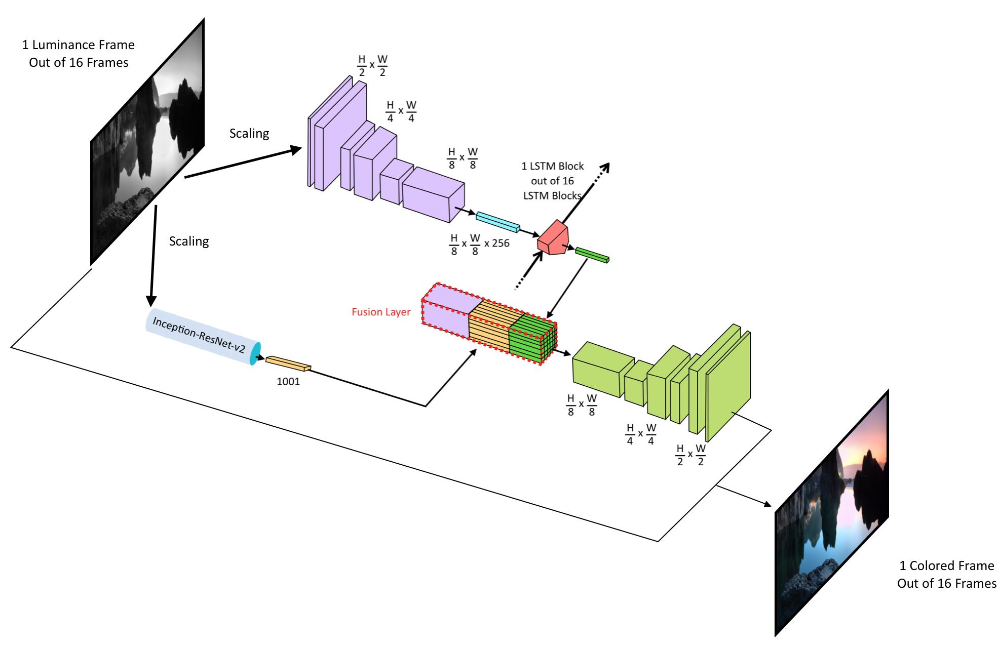
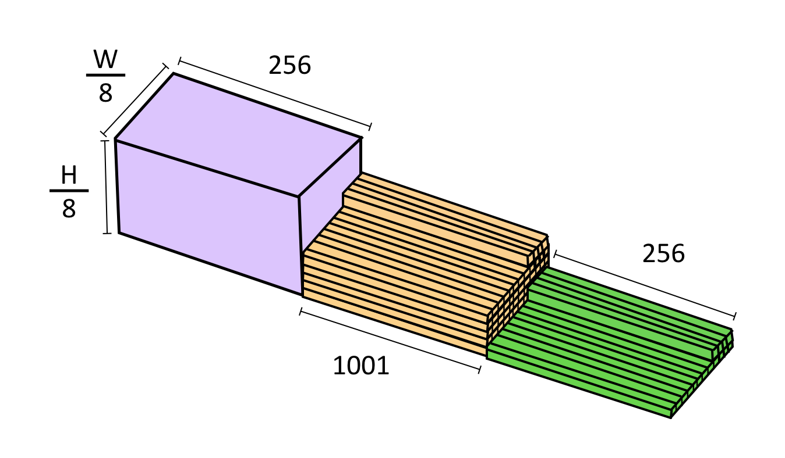

# FlowChroma

## INTRODUCTION

Given a greyscale image, colorizing it to achieve a natural look has been a much-explored research problem in the recent years. A primary goal has been to produce diverse colorizations, reversing the many-to-one nature of capturing an image in black and white, while also providing plausible colorizations that apply correct colors to identified objects. The image colorization problem has been explored extensively, but colorizing black and white videos has largely been left behind. Video colorization could be used as a video preprocessing technique, such as to enhance CCTV footage, and to restore old movies and documentaries.

One could argue that video colorization could be taken as a direct extension of image colorization, where successive application of frame colorization would produce a colorized video. But obviously, there is no guarantee that the selected image colorization technique would color successive frames consistently, known as temporal coherence, as it would consider each frame as a separate task, ignoring the contextual connections between frames.  This would result in flickering colors, and altogether unusable results.

## Proposed Methodology
FlowChroma is a framework to automatically colorize grayscale videos with the help of novel machine learning techniques such as auto-encoders, convolutional neural networks (CNN) and long short-term memory networks (LSTM). 

We first convert the frames of videos into CIE [L\*a\*b\* color space](https://en.wikipedia.org/wiki/Lab_color_space). CIE L\*a\*b\* color space is a 3-dimensional color space. If we have a gray color frame that means we already have the L part of that particular frame, L denotes luminance. The next step is finding a possible a* and b* combination and fuse all of them together to come up with a  final colored frame, given that there is a temporal coherence between the predicting a* and b* combinations. Therefore, the main assumption in here is, for each and every luminance component of video frames XtL ∈ RH×W×1 there exists an F such that F: XLt → (Xa\*t, Xb\*t). Since neural networks are an ideal tool for learning nonlinear functions and training data is a readily available resource for the video colorization problem, we decided to focus our efforts on finding an approximation to the colorization function with a neural network architecture.

The architecture has four basic parts,

* A time distributed CNN encoder
* A time distributed CNN decoder
* A fusion layer
* A high-level feature extractor (Inception-ResNet-v2)
* An LSTM to extract temporal features within frames

### Architectue Diagram

### Fusion Layer

The figure provides a better understanding of the model’s architecture. We take the final CNN outputs from the CNN encoder and drive it through a global average pooling 2d function, then the function’s output is used as inputs for the LSTM layer. LSTM learns how to keep the temporal coherence within subsequent frames. Outputs from the global feature extractor and the LSTM are repeated, reshaped and stacked after the output of CNN encoder, we call the resultant output as fusion layer. After the fusion layer, a time distributed decoder is added, mainly for colourization purposes.

As initial inputs to the model, we use scaled luminance layers of frames and each frame is stretched or shrunk as needed, but the aspect ratio is preserved by adding a white padding where needed. For the high-level feature extractor, luminance layer is repeated thrice. As model outputs, we get a* and b* combinations of frames.
 
The high-level feature extractor is a pre-trained [Inception-Resnet-V2](https://arxiv.org/abs/1602.07261) model without the last SoftMax layer. Inception-Resnet-V2 is the current state of the art for object recognition and it is trained on ImageNet dataset. This is an instance where we leverage from transfer learning. When training the network, we do not train the Inception network, we just keep its weights untrainable while only training the Encoder, Decoder, LSTM and a part of fusion layer.

Training such a massive network is indeed not an easy task, therefore we’ll be building the dataset as 16 frames per video, a video dataset of 4000 would suffice to witness some quality learning out of the network. Other than that we’ll have to fine tune the hyper-parameters for awhile as there are numbers of hyper-parameters related to this such as the number of LSTM cells, the number of LSTM layers and the number of CNN filters within the encoder as well as in the decoder.
